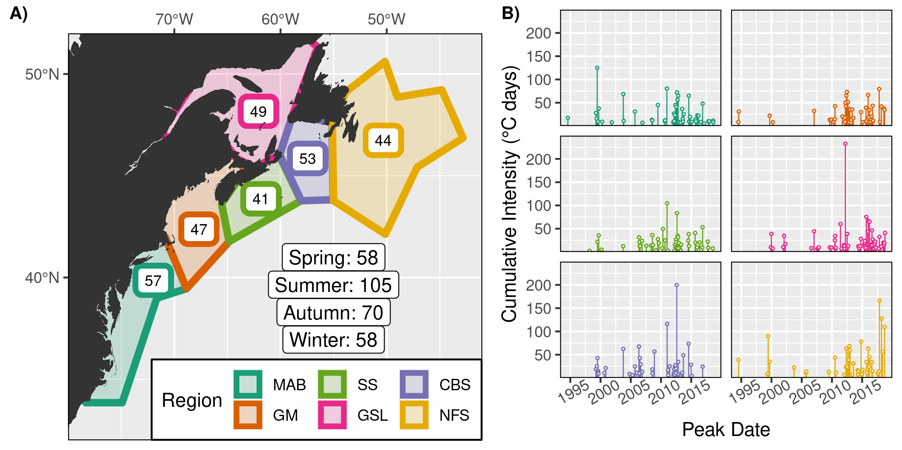

***

# Introduction

It is now a widely accepted fact that marine heatwaves (MHWs) are caused by either anomalous heat fluxes into the ocean or by anomalous advection across steep thermal gradients. A literature review has been performed that investigated the known driver of many of the recorded MHWs [@Holbrook2019]. In this same paper the researchers also showed which climate indexes (e.g. PDO) most closely related to the annual occurrence of MHWs with good success. There is however still work to be done on understanding the drivers of MHWs at the local/sub-mesoscale. In this talk I will outline how my coauthors and I have decided to investigate, quantify, and conclude on the potential drivers of MHWs in the North West (NW) Atlantic.

***

# Methods

## Study area

NW Atlantic with regions from @Richaud2016.

## Surface heat budget

Surface heat flux (W/m^2^):

* Q~sw~: The short wave energy radiated from the sun (shortwave radiation)  
* Q~lw~: The net long-wave energy radiated back from the ocean (longwave radiation)  
* Q~lh~: The heat loss by evaporation (latent heat flux)  
* Q~sh~: The sensible heat loss by conduction (sensible heat flux)
* Q~net~ = Q~sw~ + Q~lw~ + Q~lh~ + Q~sh~ (net positive downward heat flux)

Mixed layer depth:

* H: MLD (mixed-layer depth)
* T~mix~: MLD temperature
* ρ~0~: Density of sea water
* c~p~: Specific heat of sea water

Surface movement: 

* **u~mix~** = (u~mix~, v~mix~): Horizontal velocity averaged within the mixed layer
* ∇~h~ = (∂/∂x, ∂/∂y): Horizontal gradient operator
* **u~mix~**$\cdot$∇~h~T~mix~ = Temperature change due to horizontal advection

Surface temperature:

* $\delta$T~mix~ /  $\delta$t = ( (Q~net~ - (Q~s~(-H))) / ρ~0~c~p~H ) - **u~mix~**$\cdot$$\nabla$~h~T~mix~ + (*res*)

[@Benthuysen2014; @Chen2015a; @Oliver2017]

## Data

- NOAA OISST
  - SST
- ERA5
  - Qlh, Qsh, Qlw, Qsw
    - Qnet
  - MSLP
  - Precipitation
  - Evaporation
  - Cloud cover
  - Air temp. (2 m)
  - Wind (10 m): U + V
    - Wind speed + direction
- GLORYS
  - MLD
  - SSS
  - SSH
  - Bottom temp.
  - Surface currents: U + V
    - Current speed + direction

## RMSE

This statistic allows us to determine how similar the daily change in SSTa during a MHW is with the daily change in any Qx term. In order to do so we must first ensure that the daily Qx term is an integral of the SSTa. This was accomplished by first creating a 12 hour lag with the daily SSTa after the daily Qx terms. THis was possible because the ERA5 data are hourly, not daily data. With the integral created, the daily Qx terms were then divided by the density & specific heat of sea water as well as MLD:

Qx/ρ~0~c~p~H 

where Qx is the given heat flux variable, ρ~0~ = 1042, c~p~ ~= 4000, and H is the MLD on a given day. This effectively converted the Qx terms into units of °C/day. The final step in the data prep before running the RMSE was to create cumulative Qx terms during a MHW. This was done by taking the Qx on the first day of an event, and cumulatively adding the following days until the end of the event. These cumulative Qx terms were then added to the SSTa from the first day of the MHW to show how much of the daily change could be attributed to a given Qx term. For example:

SSTa1 ->      SSTa2     ->      SSTa3     ->     SSTa4  
SSTa1 ->    SST1a+Qx1   ->   SST1a+Qx2    ->   SST1a+Qx3

## Correlations

Because the other variables used in this study are not in units of °C/day we cannot directly compare them to SSTa with the RMSE statistic. Instead we must use a correlation. This is a very simple test but it does not show causality and it is also weak to giving high or low values when the scale of change between variables may not be the same. For example, SSTa may show very large fluctuations, and precipitation may show very small (possibly meaningless) fluctuations. But as long as the fluctuations in each variable are relatively large compared to their central tendency this will produce a strong correlation.

## SOM

The mean air-sea states during each MHW were fed to a SOM to produce a 12 node (4x3) grid of the most representative synoptic patterns that may be forcing MHWs. This was done to provide a broader view of what may be driving MHWs. The following figure is a schematic showing what the data for a single MHW given to the SOM looks like. There were 291 total MHWs.

***

# Results

Let's head over to the shiny app for an interactive tour of the results: https://robert-schlegel.shinyapps.io/MHWflux/

***

# Conclusion

- RMSE
  - Qnet (Qsw) is often an important driver for the onset of MHWs
  - This changes to Qlh for longer (> 14) events
  - Qsw has the lowest RMSE for decline of events but it is much higher than for onset
- Correlation
  - All of the Qx terms showed strong relationships to SSTa during the onset of MHWs
    - Less so for the decline
    - **This implies that onset of events is driven more by heat flux, and the decline by advection**
  - Top three atmosphere: air temp., MSLP, precip.-evap.
  - Top three ocean: bottom temp., SSS, MLD 
  - MLD had the strongest relationship of all variables
    - **This implies that the single best predictor of the occurrence of a MHW is a shoaling mixed layer**
- SOM
  - Three primary synoptic states:
    - Low pressure cyclonic storms (mostly Autumn/Fall)
      - The Nor'easter may cause MHWs without positive Qnet
    - High pressure anticyclonic blocking (mostly Spring/Summer)
    - High pressure zonal blocking (mostly Summer)

***

 

# Acknowledgements

 

  
  
{ width=50% }

 

{ width=40% }

 

{ width=50% }
  

 

***

 

# Questions

{ width=100% }

 

***

 

# References
